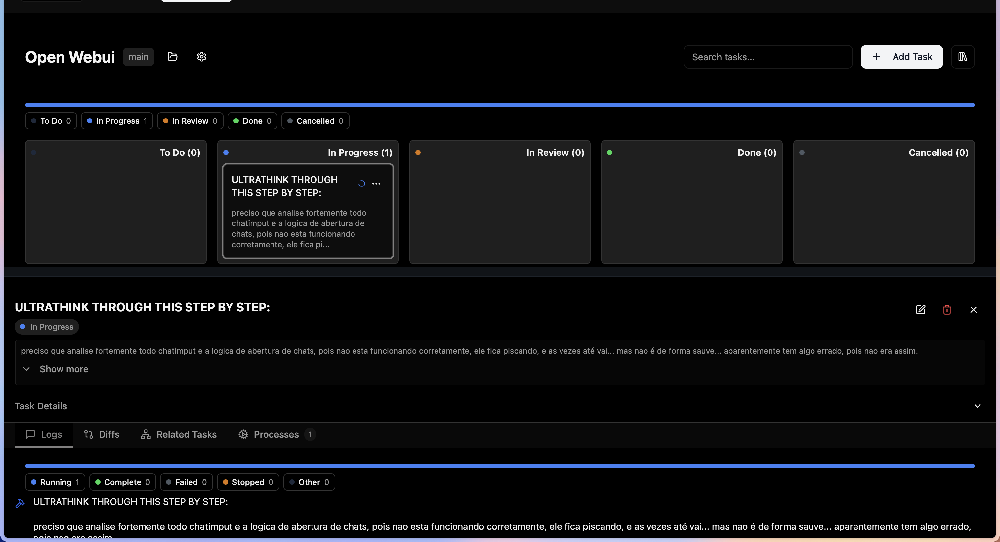
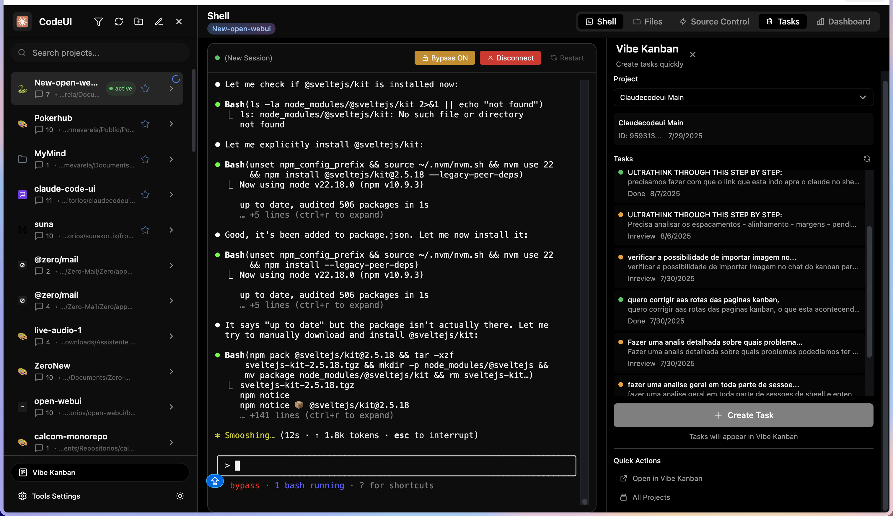
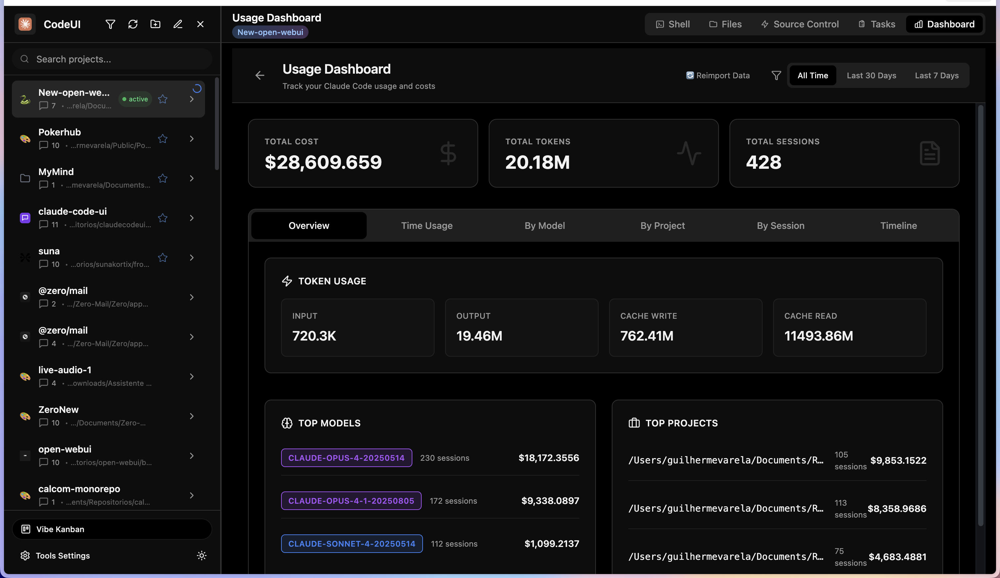
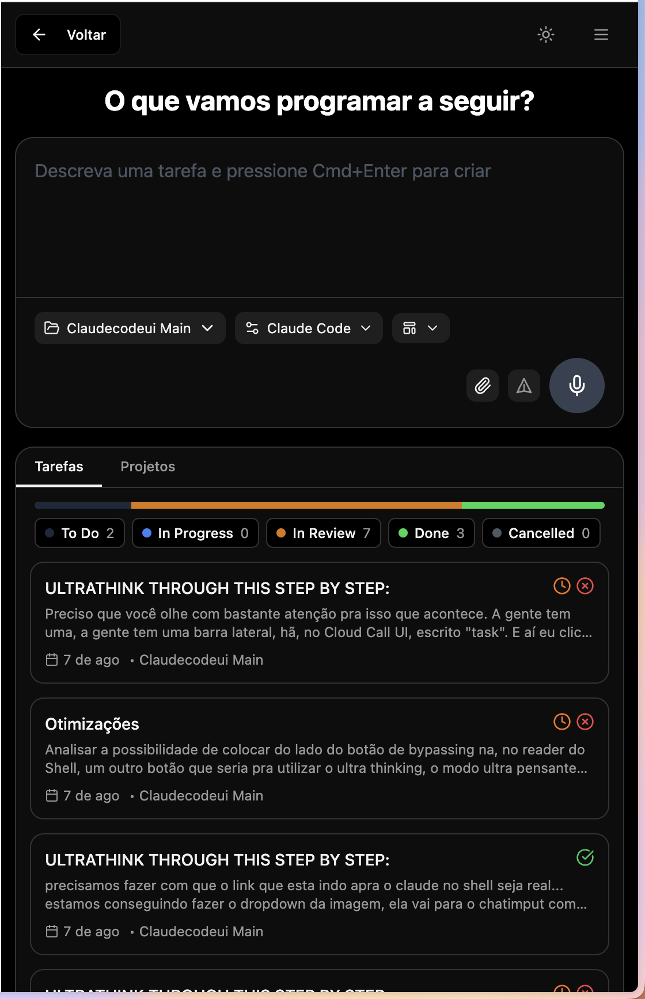
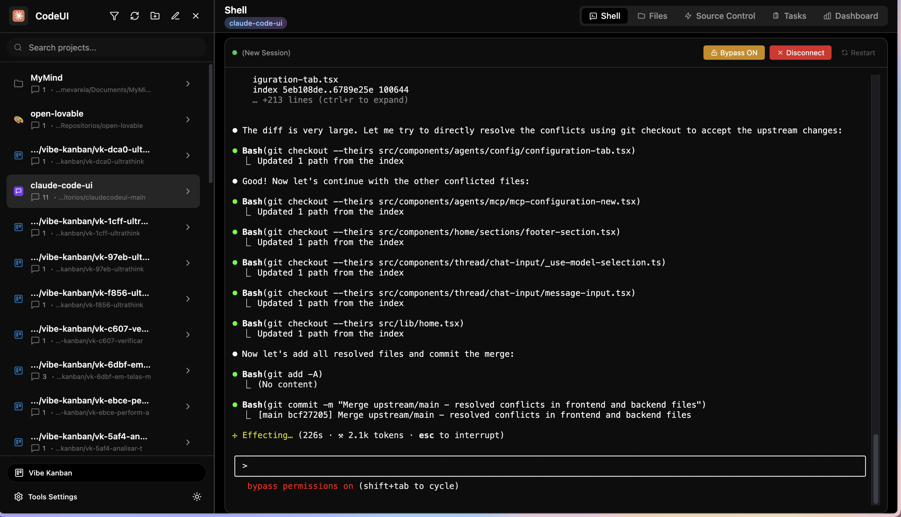
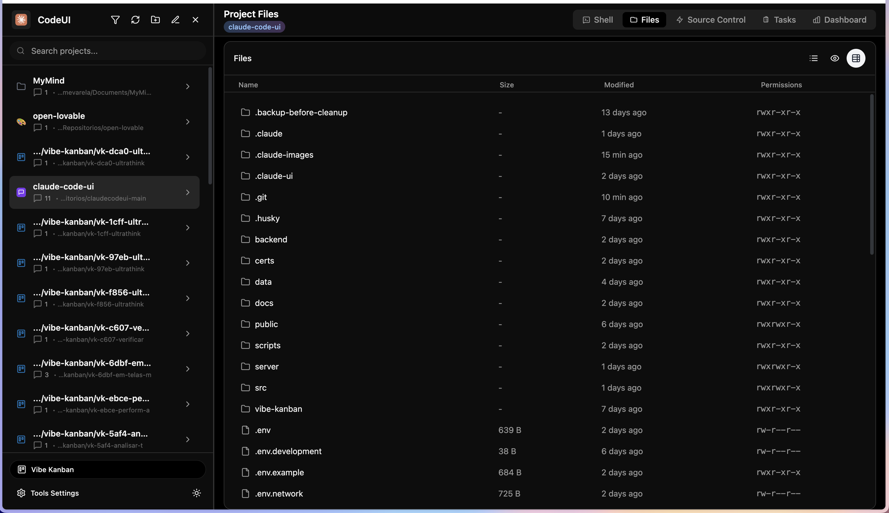
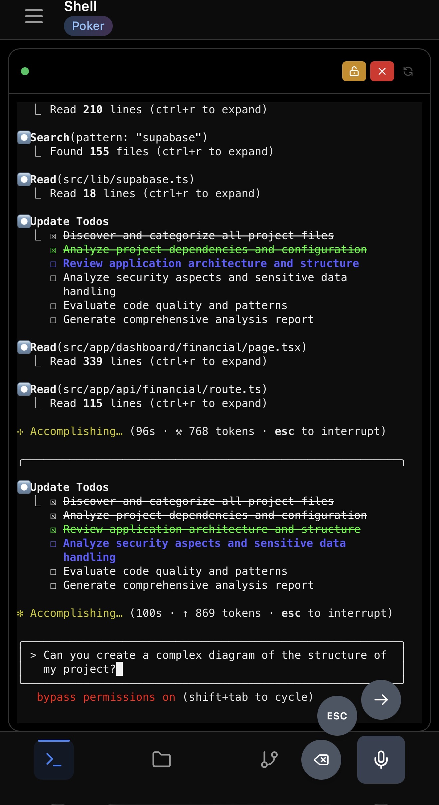
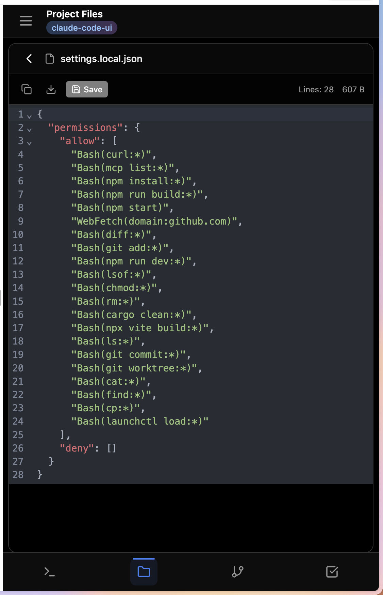
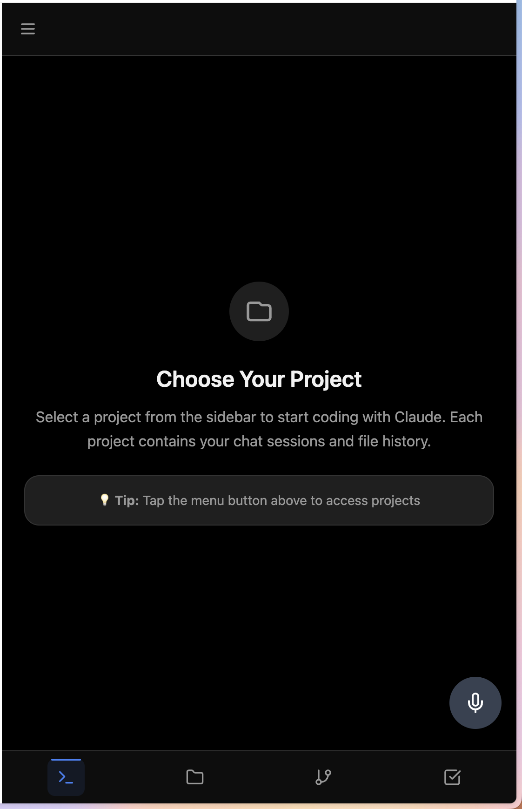

# Claude Code UI

🚀 **Interface web moderna e inteligente para Claude Code CLI** com sistema integrado de gerenciamento de tarefas, proteção de portas e acesso público via túnel.



## 📸 **Preview da Aplicação**

<div align="center">

| Terminal Integrado | Dashboard Analytics | Vibe Kanban Tasks |
|:--:|:--:|:--:|
|  |  |  |

| File Browser | Git Integration | MCP Settings |
|:--:|:--:|:--:|
|  |  |  |

</div>

## ✨ **Recursos Principais**

### 🖥️ **Interface Completa**
- **Terminal Integrado**: Execute Claude Code diretamente na interface web com XTerm.js
- **Explorador de Arquivos**: Navegue e edite arquivos com syntax highlighting CodeMirror 6
- **Git Integrado**: Gerencie branches, commits e operações git em tempo real
- **Dashboard Analytics**: Acompanhe tokens, custos e estatísticas de uso detalhadas
- **Sistema de Tarefas**: Vibe Kanban integrado para gerenciamento de projetos e workflows

### 🛡️ **Proteção Inteligente**
- **Proteção Automática de Portas**: Previne conflitos entre dev e produção
- **Sistema de Limpeza**: Remove processos órfãos do Vibe Kanban automaticamente
- **Detecção de Conflitos**: Identifica e resolve automaticamente interferências
- **Troca Segura de Modos**: Switching inteligente entre desenvolvimento e produção
- **Monitoramento Contínuo**: Supervisão em tempo real dos processos

### 🌐 **Acesso Público**
- **Túnel Ngrok**: Acesso global via `https://claudecode.ngrok.app`
- **Modo Produção**: Deploy automático com build otimizado
- **Verificação de Conectividade**: Ferramentas para testar acesso público
- **HTTPS Ready**: Configuração para produção segura

### 📱 **Experiência Moderna**
- **Totalmente Responsivo**: Interface otimizada para desktop e mobile
- **PWA Support**: Instalação como app nativo
- **Modo Escuro**: Tema adaptável automático
- **Transcrição de Voz**: Comandos por voz com OpenAI Whisper
- **Drop & Upload**: Drag-and-drop de imagens direto no terminal



## 🚀 **Início Rápido**

### 📦 **Instalação**
```bash
# Clone e instale
git clone https://github.com/seu-usuario/claudecodeui.git
cd claudecodeui
npm install
```

### 💻 **Desenvolvimento Local**
```bash
# Inicia todos os serviços com proteção de portas
npm run dev
```
**Acesse:** http://localhost:9000  
**Portas usadas:** Frontend(9000), Backend(8080), Vibe Kanban(8081)

### 🌍 **Produção com Acesso Público**
```bash
# Inicia produção + túnel ngrok (automático)
./start-background-prod.sh

# Verifica conectividade global
./check-tunnel.sh
```
**Acesse de qualquer lugar:** https://claudecode.ngrok.app

## 🔧 **Gerenciamento de Sistema** 

### Comandos de Proteção
```bash
# Verificar status atual
npm run port-status

# Trocar para produção (para dev automaticamente)
npm run switch-to-prod

# Trocar para desenvolvimento (para prod automaticamente) 
npm run switch-to-dev

# Parar tudo em caso de emergência
npm run stop-all

# Monitorar sistema de limpeza
npm run cleanup-status
npm run cleanup-force
```

### Por Que Isso é Importante?
Antes, executar `npm run dev` e depois `./start-background-prod.sh` causava:
- ❌ Conflitos de porta (EADDRINUSE)
- ❌ Processos interferindo uns com os outros
- ❌ Necessidade de cleanup manual
- ❌ Vibe Kanban ficando sobrecarregado com processos órfãos

**Agora:** O sistema detecta automaticamente conflitos e resolve de forma inteligente.

## 📋 **Pré-requisitos**

### Essenciais
- **Node.js 18+**
- **Claude Code CLI** instalado: `npm install -g @anthropic-ai/claude-code`
- **Token Claude** válido configurado

### Opcionais
- **Rust/Cargo** (para Vibe Kanban backend)
- **Ngrok** (para acesso público) - `brew install ngrok`
- **OpenAI API Key** (para transcrição de voz)

## 🏗️ **Arquitetura do Sistema**

### 🖼️ **Três Serviços Integrados**

#### 1. **Frontend (React/Vite)** - Porto 9000
- React 18 com hooks modernos
- Tailwind CSS + modo escuro
- CodeMirror 6 (syntax highlighting)
- XTerm.js (terminal emulation)
- PWA com service worker

#### 2. **Backend (Node.js/Express)** - Porto 8080  
- WebSocket para terminal em tempo real
- SQLite para projetos e analytics
- JWT authentication
- Proxy para Claude Code CLI
- API RESTful completa
- Sistema de limpeza de processos órfãos

#### 3. **Vibe Kanban (Rust/Actix)** - Porto 8081
- Sistema avançado de tarefas
- Integração Git nativa
- Database SQLite compartilhado
- Performance otimizada
- Limpeza automática de processos travados

### 📊 **Fluxo de Dados**
```
Frontend ←→ Backend ←→ Claude CLI
    ↓         ↓
    ↓    Vibe Kanban
    ↓         ↓
   PWA    SQLite DB
```

## ⭐ **Funcionalidades Principais**

### 1. **Terminal Shell Integrado**


- **Claude Code Integration**: Execute comandos Claude diretamente
- **Real-time Streaming**: Respostas em tempo real via WebSocket  
- **Image Drop & Upload**: Drag-and-drop de imagens no terminal
- **Voice Transcription**: Comandos por voz com Whisper API
- **Session Management**: Múltiplas sessões de terminal
- **Command History**: Histórico persistente de comandos

### 2. **File Browser & Editor**


- **Split-view Editing**: Browse e edite arquivos lado a lado
- **Syntax Highlighting**: CodeMirror 6 com suporte a múltiplas linguagens
- **File Tree Navigation**: Navegação hierárquica de arquivos
- **Live Preview**: Preview de imagens e documentos
- **Auto-save**: Salvamento automático durante edição
- **Search & Replace**: Busca e substituição avançada



### 3. **Git Integration**


- **Branch Management**: Criação, troca e merge de branches
- **Commit Operations**: Staging, commits e push em tempo real
- **Diff Viewer**: Visualização de diferenças com highlighting
- **History Timeline**: Histórico de commits com navegação
- **Conflict Resolution**: Resolução de conflitos integrada
- **Remote Sync**: Sincronização com repositórios remotos

### 4. **Vibe Kanban Tasks**


- **Kanban Board**: Quadro visual de tarefas (To Do, In Progress, Done)
- **Task Management**: CRUD completo de tarefas com categorias
- **Project Integration**: Integração nativa com projetos Claude
- **Git Workflow**: Branches automáticos por tarefa
- **Quick Panel**: Painel lateral rápido no Claude Code UI
- **Progress Tracking**: Acompanhamento detalhado de progresso

### 5. **Dashboard Analytics**


- **Token Usage**: Monitoramento de tokens input/output
- **Cost Tracking**: Cálculo de custos baseado em preços Anthropic
- **Session Analytics**: Duração, mensagens, taxa de sucesso
- **Performance Metrics**: Tempo de resposta, taxa de erro
- **Usage Trends**: Gráficos e tendências de uso
- **Export Data**: Exportação de dados para análise

### 6. **MCP Servers Integration**


- **Context7 Integration**: Documentação de bibliotecas em tempo real
- **GitHub Integration**: Acesso a repositórios e APIs
- **Custom Servers**: Adição de servidores MCP personalizados
- **Tool Management**: Habilitação/desabilitação de ferramentas
- **Configuration UI**: Interface visual para configuração
- **Server Health**: Monitoramento de status dos servidores

### 7. **Project Selection & Management**


- **Multi-project Support**: Gerenciar múltiplos projetos Claude
- **Session History**: Histórico completo de conversas
- **Project Switching**: Troca rápida entre projetos
- **Auto-detection**: Detecção automática de novos projetos
- **Custom Icons**: Ícones personalizados por tipo de projeto
- **Search & Filter**: Busca e filtros avançados

## ⚙️ **Configuração Avançada**

### 🔐 **Variáveis de Ambiente** (Opcional)
```env
# .env (na raiz do projeto)
JWT_SECRET=seu_jwt_secret_seguro
OPENAI_API_KEY=sk-xxx  # Para transcrição de voz
PORT=8080              # Backend
VITE_PORT=9000         # Frontend  
VIBE_PORT=8081         # Vibe Kanban
```

### 🔑 **Autenticação**
- Primeiro acesso: Cria usuário automaticamente
- JWT tokens com renovação automática
- Sessions persistentes entre reinicializações
- Proteção de rotas com middleware

### 🛡️ **Segurança**
- **Tools Disabled by Default**: Todas ferramentas precisam ser habilitadas explicitamente
- **JWT Authentication**: Tokens seguros com renovação automática
- **Port Protection**: Monitoramento contra processos não autorizados
- **Input Validation**: Validação rigorosa de todas entradas
- **HTTPS Ready**: Configuração para produção segura

## 🛠️ **Comandos Completos**

### Desenvolvimento
```bash
npm install            # Instalar dependências
npm run dev           # Desenvolvimento com proteção (RECOMENDADO)
npm run server        # Apenas backend (debugging)
npm run client        # Apenas frontend (debugging)  
npm run vibe-backend  # Apenas Vibe Kanban (debugging)
./start-network.sh    # Desenvolvimento com acesso rede (0.0.0.0)
```

### Produção  
```bash
npm run build                # Build para produção
./start-background-prod.sh   # Produção + túnel público
./check-tunnel.sh           # Verificar conectividade
npm start                   # Produção local (sem túnel)
```

### Gerenciamento de Sistema (macOS)
```bash
./claudecode-service.sh install    # Instalar como serviço sistema
./claudecode-service.sh status     # Status do serviço
./claudecode-service.sh uninstall  # Remover serviço
```

### Utilitários
```bash
npm run port-status       # Status atual dos processos
npm run protect-ports     # Executar apenas proteção de portas
npm run cleanup-status    # Status do sistema de limpeza
npm run cleanup-force     # Forçar limpeza de processos órfãos
node scripts/test-cleanup-system.js  # Testar sistema de limpeza
```

## 🚨 **Resolução de Problemas**

### ❌ **Erro: Port Already in Use**
```bash
npm run port-status  # Ver o que está rodando
npm run stop-all     # Parar tudo
npm run dev          # Ou ./start-background-prod.sh
```

### ❌ **Terminal não aceita input**
- Atualizar página (F5)
- Verificar console do navegador
- Reiniciar: `npm run dev`

### ❌ **Vibe Kanban não carrega**
```bash
cd vibe-kanban
cargo build --release
npm run dev
```

### ❌ **Dashboard sem dados**
- Verificar aba Network no navegador
- Confirmar permissões em `~/.claude/projects/`
- Usar Claude CLI pelo menos uma vez

### ❌ **Processos órfãos Vibe Kanban**
```bash
npm run cleanup-status  # Verificar sistema de limpeza
npm run cleanup-force   # Forçar limpeza manual
```

## 📁 **Estrutura do Projeto**

```
claudecodeui/
├── src/                    # Frontend React
│   ├── components/         # Componentes React
│   │   ├── Dashboard.jsx   # Dashboard de analytics
│   │   ├── Shell.jsx       # Terminal integrado
│   │   ├── FileTree.jsx    # Navegador de arquivos
│   │   ├── GitPanel.jsx    # Painel Git
│   │   ├── VibeTaskPanel.jsx # Painel Vibe Kanban
│   │   └── ...
│   ├── contexts/          # Context providers
│   └── utils/             # Utilitários frontend
├── server/                # Backend Node.js  
│   ├── routes/            # Endpoints API
│   ├── database/          # SQLite management
│   ├── cleanupService.js  # Sistema limpeza processos
│   └── middleware/        # Express middleware
├── scripts/               # Scripts de automação
│   ├── dev.js             # Orquestrador desenvolvimento
│   ├── port-protection.js # Proteção de portas
│   ├── port-management.js # Gerenciamento inteligente
│   └── test-cleanup-system.js # Testes limpeza
├── vibe-kanban/           # Sistema tarefas Rust
├── public/
│   └── screenshots/       # Screenshots da aplicação
└── docs/                  # Documentação completa
```

## 🎯 **Casos de Uso**

### 👨‍💻 **Para Desenvolvedores**
- Desenvolvimento com Claude Code em interface web moderna
- Gerenciamento visual de projetos e tarefas
- Analytics de uso e custos em tempo real
- Workflow git integrado e automatizado

### 🌐 **Para Acesso Remoto** 
- Trabalho remoto via túnel público seguro
- Demonstrações para clientes com interface profissional
- Colaboração em equipe com sessões compartilhadas
- Acesso mobile responsivo para desenvolvimento em movimento

### 🏢 **Para Times**
- Sistema de tarefas colaborativo com Vibe Kanban
- Tracking de custos centralizados e relatórios
- Sessões compartilhadas para pair programming
- Monitoramento de uso e produtividade

## 🤝 **Suporte & Contribuição**

### 🐛 **Reportar Problemas**
- Abra uma issue detalhada no GitHub
- Inclua logs relevantes (`npm run dev` output)
- Descreva steps para reproduzir
- Anexe screenshots se relevante

### 🎉 **Contribuições**
- Fork o repositório
- Crie branch para feature/fix
- Teste localmente com `npm run dev`
- Abra Pull Request com descrição detalhada
- Siga os padrões de código existentes

## 📄 **Licença**

MIT License - veja [LICENSE](LICENSE) para detalhes.

---

## ⭐ **Features em Desenvolvimento**

- [ ] Multi-language support
- [ ] Plugin system para extensões
- [ ] Advanced analytics com machine learning
- [ ] Team collaboration features avançadas
- [ ] Docker containerization completa
- [ ] Cloud deployment options (AWS, GCP, Azure)
- [ ] Real-time collaboration
- [ ] Advanced file search e indexing
- [ ] AI-powered code suggestions
- [ ] Integration com mais MCP servers

---

## 🚀 **Como Começar**

**Desenvolvimento:**
```bash
npm install && npm run dev
```

**Acesso público:**
```bash  
./start-background-prod.sh
```

**Problemas?**
```bash
npm run port-status && npm run stop-all
```

**Precisa de ajuda?** Abra uma [issue](https://github.com/seu-usuario/claudecodeui/issues) ou consulte a [documentação completa](./CLAUDE.md).

---

<div align="center">
  <strong>Desenvolvido com ❤️ para a comunidade Claude Code</strong>
</div>